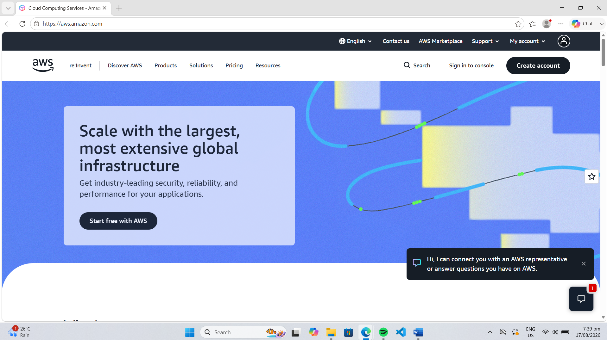

# AWS Research

## 1. Brief Overview

Amazon Web Services (AWS) is a cloud computing platform provided by Amazon. It offers a wide range of cloud services that organizations can use to build, deploy, store, and manage applications and data.

AWS was launched in 2006 and is used by startups, enterprises, government organizations, and other institutions.

## 2. Global Infrastructure

AWS operates a global cloud infrastructure organized into Regions and Availability Zones. AWS currently lists 39 geographic Regions and 123 Availability Zones. This infrastructure helps organizations deploy applications closer to their users and improve availability and performance.

## 3. Cloud Management Console

The AWS Management Console is a web-based interface used to access and manage AWS services. Through the console, users can create and manage resources, select AWS Regions, monitor services, manage users, and view billing information.

## 4. Four Core Services

### Amazon EC2
Amazon Elastic Compute Cloud (EC2) provides resizable virtual computing capacity in the AWS cloud.

### Amazon S3
Amazon Simple Storage Service (S3) provides object storage for data such as files, backups, application data, and other digital content.

### Amazon RDS
Amazon Relational Database Service (RDS) is a managed service for running relational databases in the AWS cloud.

### Amazon VPC
Amazon Virtual Private Cloud (VPC) allows users to create and manage a logically isolated virtual network for AWS resources.

## 5. Three Advantages

1. **Wide Range of Services** – AWS provides a large portfolio of cloud services for computing, storage, databases, networking, security, analytics, and other workloads.

2. **Global Infrastructure** – AWS provides infrastructure across many geographic Regions and Availability Zones, allowing organizations to deploy applications globally.

3. **Scalability and Flexibility** – AWS services allow organizations to increase or decrease resources based on their workload and business requirements.

## 6. Typical Enterprise Use Cases

AWS can be used by enterprises for web and mobile applications, data storage and backup, database hosting, business applications, artificial intelligence, analytics, disaster recovery, and global application deployment.

## AWS Homepage Screenshot

## Sources

- AWS Official Website: https://aws.amazon.com/
- AWS About: https://aws.amazon.com/about-aws/
- AWS Global Infrastructure: https://aws.amazon.com/about-aws/global-infrastructure/
- AWS Management Console: https://aws.amazon.com/console/
- AWS Documentation: https://aws.amazon.com/documentation-overview/
- 
