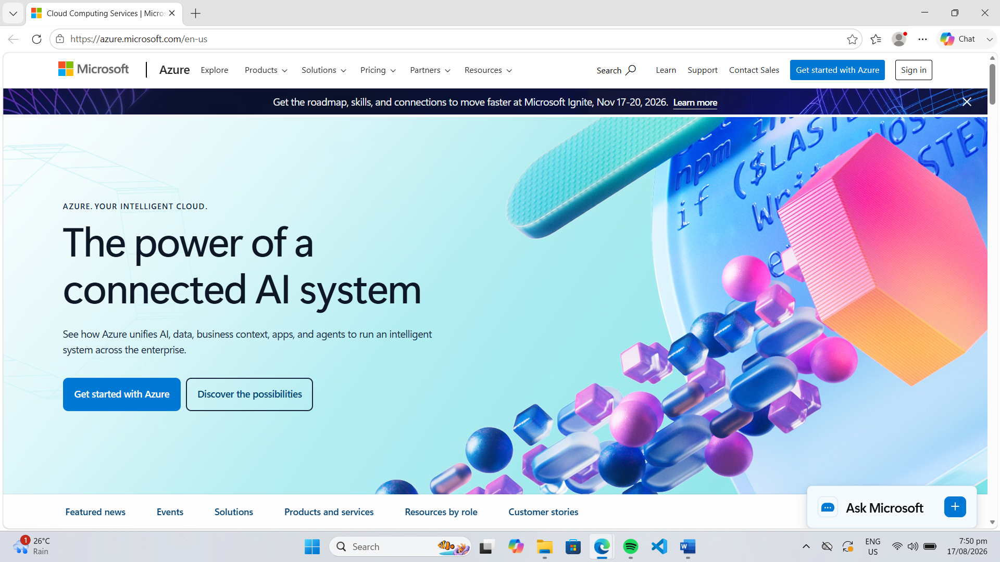

# Azure Research

## 1. Brief Overview

Microsoft Azure is a cloud computing platform developed by Microsoft. It provides cloud services for computing, storage, databases, networking, analytics, artificial intelligence, security, and application development.

Azure is widely used by organizations that already depend on Microsoft technologies and also supports many other operating systems, programming languages, and application platforms.

## 2. Global Infrastructure

Azure operates a global infrastructure consisting of geographic regions and datacenters. Its worldwide infrastructure allows organizations to deploy applications closer to their customers and helps support availability, performance, and business continuity.

## 3. Cloud Management Console

The Azure portal is Microsoft's web-based management interface for Azure resources. Users can use the portal to create, configure, monitor, and manage virtual machines, databases, storage, networking, security, and other cloud resources.

## 4. Four Core Services

### Azure Virtual Machines

Azure Virtual Machines provides scalable virtual machines that can run Windows or Linux workloads in the cloud.

### Azure Blob Storage

Azure Blob Storage is an object storage service designed for storing large amounts of unstructured data such as documents, images, videos, and backups.

### Azure SQL Database

Azure SQL Database is a managed relational database service based on Microsoft SQL Server technology.

### Azure Virtual Network

Azure Virtual Network allows cloud resources to communicate securely with each other, the internet, and on-premises networks.

## 5. Three Advantages

1. **Microsoft Integration** – Azure provides strong integration with Microsoft products and technologies such as Windows Server, Microsoft 365, and Microsoft Entra ID.

2. **Hybrid Cloud Capabilities** – Azure supports organizations that need to connect their existing on-premises infrastructure with cloud services.

3. **Wide Range of Services** – Azure provides services for computing, storage, databases, networking, security, artificial intelligence, analytics, and application development.

## 6. Typical Enterprise Use Cases

Organizations can use Azure for hosting business applications, migrating Windows Server workloads, managing databases, building web and mobile applications, implementing hybrid cloud environments, performing data analytics, and developing artificial intelligence solutions.

## Azure Homepage Screenshot

## Sources

- Microsoft Azure: https://azure.microsoft.com/
- Azure Documentation: https://learn.microsoft.com/azure/
- Azure Global Infrastructure: https://azure.microsoft.com/explore/global-infrastructure/
- Azure Portal: https://portal.azure.com/
