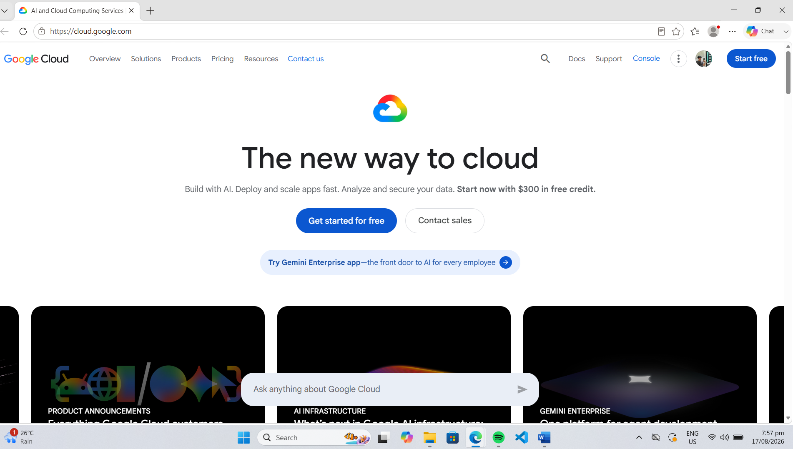

# GCP Research

## 1. Brief Overview

Google Cloud Platform (GCP), also known as Google Cloud, is a cloud computing platform developed by Google. It provides services for computing, storage, databases, networking, artificial intelligence, machine learning, data analytics, and application development.

GCP is particularly known for its data, analytics, artificial intelligence, machine learning, and cloud-native technologies.

## 2. Global Infrastructure

Google Cloud operates a global infrastructure made up of regions and zones distributed around the world. This infrastructure allows organizations to deploy applications and services in different geographic locations and helps improve availability, performance, and reliability.

## 3. Cloud Management Console

The Google Cloud Console is a web-based interface used to manage Google Cloud resources and services. Users can create and configure resources, monitor applications, manage projects, control access, and review usage and billing.

## 4. Four Core Services

### Compute Engine

Compute Engine provides virtual machines that allow organizations to run Linux and Windows workloads in Google Cloud.

### Cloud Storage

Cloud Storage is an object storage service used to store and retrieve files, backups, media, and other types of data.

### Cloud SQL

Cloud SQL is a fully managed relational database service that supports database engines such as MySQL, PostgreSQL, and SQL Server.

### Google Kubernetes Engine

Google Kubernetes Engine (GKE) is a managed Kubernetes service used to deploy, manage, and scale containerized applications.

## 5. Three Advantages

1. **Strong AI and Machine Learning Capabilities** – Google Cloud provides services and tools for developing and deploying artificial intelligence and machine learning applications.

2. **Data and Analytics** – Google Cloud provides powerful data processing and analytics services that can help organizations analyze large amounts of information.

3. **Kubernetes and Cloud-Native Technologies** – Google created Kubernetes and provides GKE for managing containerized applications at scale.

## 6. Typical Enterprise Use Cases

Organizations can use Google Cloud for web and mobile applications, data analytics, artificial intelligence and machine learning, containerized applications, database hosting, large-scale data processing, and global application deployment.

## Google Cloud Homepage Screenshot

## Sources

- Google Cloud: https://cloud.google.com/
- Google Cloud Documentation: https://cloud.google.com/docs
- Google Cloud Infrastructure: https://cloud.google.com/about/locations
- Google Cloud Console: https://console.cloud.google.com/
- Google Kubernetes Engine: https://cloud.google.com/kubernetes-engine
